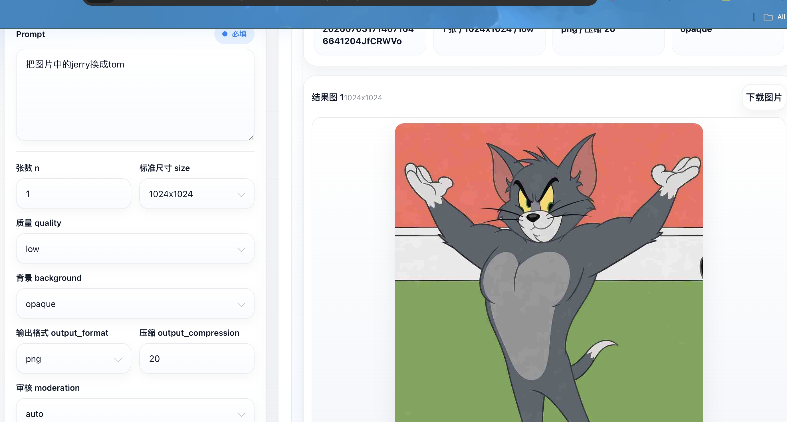

# GPT Image2 个人图片站

基于 OpenAI 兼容 API 的本地个人图片生成站，支持 image2 异步任务提交、轮询、预览与下载。

**零依赖、单文件**，双击 `gpt-image2本地工作站.html` 即可在浏览器中使用。

---

## 功能概览

| 功能 | 说明 |
|------|------|
| 文生图 | 输入 Prompt 生成图片 |
| 图生图 | 提供参考图 URL + 可选蒙版 URL，进行局部编辑或视觉延展 |
| 异步轮询 | 提交任务后自动轮询，最长等待 10 分钟 |
| 手动查询 | 通过 request_id 单独查询任务状态和结果 |
| 图片下载 | 逐张下载生成结果，自动推断文件扩展名 |
| 任务恢复 | 页面加载时自动恢复上次未完成的任务 |

---

## 接口设置

点击 **「接口设置」** 按钮，填写以下三个参数（仅保存在浏览器 localStorage，不会上传到任何服务器）：

| 参数 | 说明 | 默认值 |
|------|------|--------|
| Base URL | 你的 API 端点地址 | 无（需自行填写，例如 `https://api.example.com/v1`） |
| API Key | 你的个人密钥 | 无（需自行填写） |
| Model ID | 模型标识 | `openai/gpt-image-2` |

---

## 参数说明

对照 [OpenAI Image Generation API 官方文档](https://developers.openai.com/api/docs/guides/image-generation#customize-image-output) 设计。

### 核心参数

| 参数 | 类型 | 可选值 | 说明 |
|------|------|--------|------|
| `prompt` | 文本 | — | 必填，描述画面主体、材质、构图、镜头、光线、风格等 |
| `n` | 数字 | 1–10 | 一次生成几张不同的完整图片 |
| `size` | 下拉 | `auto` / `1024x1024` / `1536x1024` / `1024x1536` / `2048x2048` / `2048x1152` / `3840x2160` / `2160x3840` | 输出图片尺寸 |
| `quality` | 下拉 | `auto` / `low` / `medium` / `high` | 渲染质量 |
| `background` | 下拉 | 留空 / `auto` / `opaque` | 背景模式（gpt-image-2 不支持 transparent） |

### 输出参数

| 参数 | 类型 | 可选值 | 说明 |
|------|------|--------|------|
| `output_format` | 下拉 | 留空 / `png` / `jpeg` / `webp` | 输出文件格式 |
| `output_compression` | 数字 | 0–100 | 仅对 jpeg/webp 有效，压缩级别 |

### 高级参数

| 参数 | 类型 | 可选值 | 说明 |
|------|------|--------|------|
| `moderation` | 下拉 | 留空 / `auto` / `low` | 审核严格度 |
| `partial_images` | 数字 | 0–3 | 生成过程中的中间预览图数量（流式传输时生效） |

### 图生图扩展

| 参数 | 说明 |
|------|------|
| 参考图 URL | 图生图模式必填，支持 HTTP/HTTPS 或 OSS 地址 |
| 蒙版 URL | 可选，用于指定编辑区域 |

---

## 超时与轮询设置

| 配置项 | 值 | 说明 |
|--------|-----|------|
| 轮询间隔 | 5 秒 | 每次查询任务状态的间隔 |
| 总超时 | 10 分钟 | 超过此时间未返回结果则报超时 |
| completed 重试 | 最多 10 次 | 状态为 completed 但图片未落盘时的额外等待 |
| 手动查询 | 无限制 | 通过 request_id 在「请求查询板块」随时查询 |

---

## 错误处理

### 错误展示机制

发生错误时会同时触发两种展示：

1. **Toast 弹窗**（右上角，5 秒自动消失）— 快速感知
2. **右侧错误卡片**（持续展示，直到下次生成）— 包含完整错误信息、Request ID、时间戳，便于截图和排查

### 常见错误

| 错误信息 | 可能原因 | 解决方法 |
|----------|----------|----------|
| 请先在设置里填写 Base URL、API Key 和 Model ID | 接口未配置 | 点击「接口设置」填写参数 |
| 请输入提示词后再开始生成 | Prompt 为空 | 输入画面描述 |
| 图生图模式需要填写参考图 URL | 图生图模式未提供参考图 | 填写参考图 URL |
| 异步任务提交失败 | 接口地址/密钥/模型配置错误 | 检查设置中的参数 |
| 图片生成失败 | 模型返回错误状态 | 查看错误详情，调整 Prompt 或参数 |
| 图片生成超时（已等待 10 分钟） | 任务耗时过长 | 稍后重试或简化提示词 |
| 任务已完成但未能提取图片链接 | API 返回格式与预期不一致 | 复制 request_id 手动查询 |

---

## API Key 安全性

| 安全措施 | 说明 |
|----------|------|
| 本地存储 | Key 仅保存在浏览器 localStorage，不同设备互不可见 |
| 传输方式 | 仅通过 HTTPS `Authorization: Bearer` 头发送至用户配置的 Base URL |
| 零第三方依赖 | 纯内联 CSS + 原生 JS，无任何外部统计/追踪脚本 |
| 默认值为空 | HTML 文件中不含任何硬编码 Key |
| 输入掩码 | 使用 `<input type="password">`，输入时不可见 |
| 摘要脱敏 | 侧边栏显示格式为 `sk-xx••••xxxx` |

> 建议通过文件（如邮件附件、网盘）发送 HTML 文件，让收件人在本地浏览器用 `file://` 协议打开。

---

## 技术架构

| 维度 | 详情 |
|------|------|
| 文件数 | 1 个 `gpt-image2本地工作站.html` |
| 外部依赖 | 无 |
| CSS | 内嵌 `<style>`，Glass Morphism 风格 |
| JavaScript | 内嵌 `<script>`（IIFE 模式），原生 ES6+ |
| 数据持久化 | `localStorage`（3 个 key） |
| API 端点 | `POST /tasks/generations`（提交） `GET /tasks/generations/{request_id}`（查询） 端点拼接在 Base URL 之后，例如 `https://your-api.com/v1/tasks/generations` |
| 响应格式 | 兼容多种嵌套结构（URL 图片 + Base64 图片） |

---

## 部署说明

1. 将 `gpt-image2本地工作站.html` 发送给用户
2. 双击在浏览器中打开
3. 填写自己的 Base URL、API Key、Model ID
4. 开始使用

---

## 版权

made by [Winston](https://github.com/Winston-Tao1)